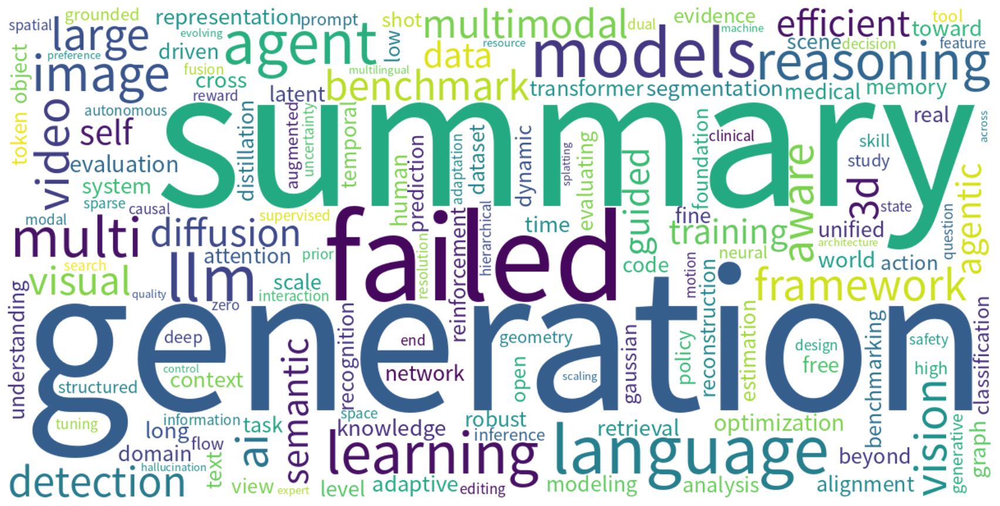

# Monthly arXiv Review — May 2026

**Period:** 2026-05-01 to 2026-05-31  
**Total papers:** 7189  
**Active weeks:** 5  

---

## 📈 Paper Volume Ranking by Category

| Rank | Category | Papers | Share |
| ---: | -------- | -----: | ----: |
| 1 | cs.CV | 3036 | 42.2% |
| 2 | cs.AI | 1871 | 26.0% |
| 3 | cs.CL | 1783 | 24.8% |
| 4 | cs.IT | 263 | 3.7% |
| 5 | cs.GT | 119 | 1.7% |
| 6 | cs.CE | 117 | 1.6% |

---

## ☁️ Research Hotspot Word Cloud

*The word cloud above visualizes the most frequently appearing research topics and concepts across all papers this month.*

---

## 📅 Weekly Hotspot Evolution

| Week | Papers | Top Research Topics |
| ---- | -----: | ------------------- |
| 2026-W18 | 244 | — |
| 2026-W19 | 1320 | — |
| 2026-W20 | 2071 | — |
| 2026-W21 | 1635 | — |
| 2026-W22 | 1919 | — |

---

## 🤖 AI-Generated Monthly Trend Analysis

Trend analysis generation failed.

---

*Generated automatically on 2026-06-01 10:23 UTC*