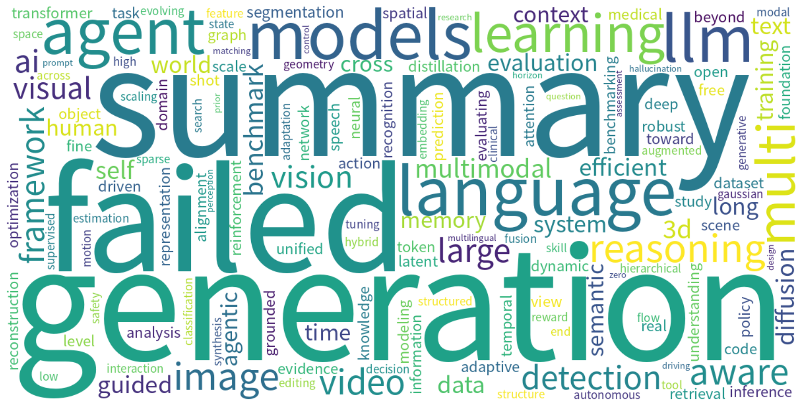

# Monthly arXiv Review — June 2026

**Period:** 2026-06-01 to 2026-06-30  
**Total papers:** 6672  
**Active weeks:** 5  

---

## 📈 Paper Volume Ranking by Category

| Rank | Category | Papers | Share |
| ---: | -------- | -----: | ----: |
| 1 | cs.CV | 2770 | 41.5% |
| 2 | cs.CL | 1814 | 27.2% |
| 3 | cs.AI | 1581 | 23.7% |
| 4 | cs.IT | 237 | 3.6% |
| 5 | cs.GT | 152 | 2.3% |
| 6 | cs.CE | 118 | 1.8% |

---

## ☁️ Research Hotspot Word Cloud

*The word cloud above visualizes the most frequently appearing research topics and concepts across all papers this month.*

---

## 📅 Weekly Hotspot Evolution

| Week | Papers | Top Research Topics |
| ---- | -----: | ------------------- |
| 2026-W23 | 1874 | — |
| 2026-W24 | 1531 | — |
| 2026-W25 | 1370 | — |
| 2026-W26 | 1205 | — |
| 2026-W27 | 692 | — |

---

## 🤖 AI-Generated Monthly Trend Analysis

Trend analysis generation failed.

---

*Generated automatically on 2026-07-01 08:53 UTC*