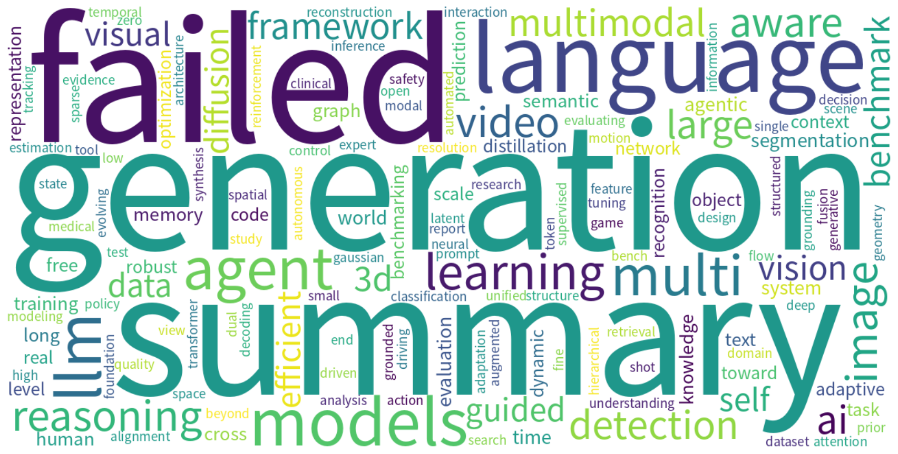

# Monthly arXiv Review — July 2026

**Period:** 2026-07-01 to 2026-07-31  
**Total papers:** 5718  
**Active weeks:** 5  

---

## 📈 Paper Volume Ranking by Category

| Rank | Category | Papers | Share |
| ---: | -------- | -----: | ----: |
| 1 | cs.CV | 2491 | 43.6% |
| 2 | cs.AI | 1598 | 27.9% |
| 3 | cs.CL | 1159 | 20.3% |
| 4 | cs.IT | 250 | 4.4% |
| 5 | cs.GT | 123 | 2.2% |
| 6 | cs.CE | 96 | 1.7% |
| 7 | eess.IV | 1 | 0.0% |

---

## ☁️ Research Hotspot Word Cloud

*The word cloud above visualizes the most frequently appearing research topics and concepts across all papers this month.*

---

## 📅 Weekly Hotspot Evolution

| Week | Papers | Top Research Topics |
| ---- | -----: | ------------------- |
| 2026-W27 | 826 | — |
| 2026-W28 | 1030 | — |
| 2026-W29 | 1219 | — |
| 2026-W30 | 1247 | — |
| 2026-W31 | 1396 | — |

---

## 🤖 AI-Generated Monthly Trend Analysis

Trend analysis generation failed.

---

*Generated automatically on 2026-08-01 07:29 UTC*