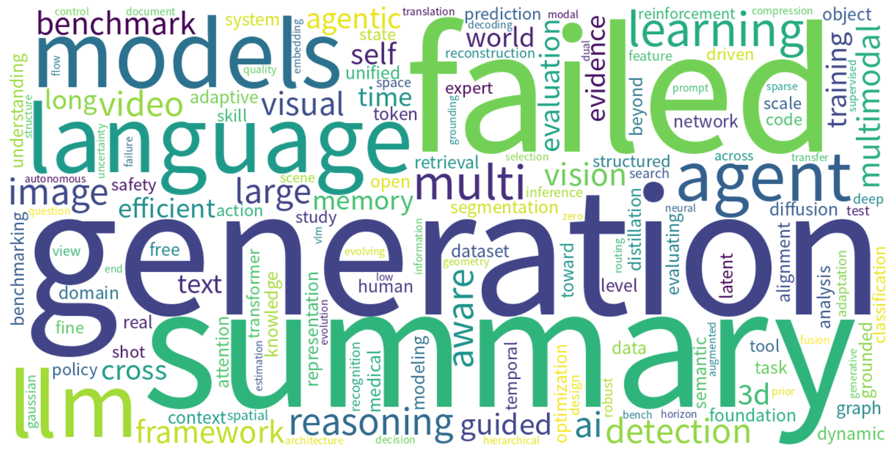

# Monthly arXiv Review — August 2026

**Period:** 2026-08-01 to 2026-08-31  
**Total papers:** 5603  
**Active weeks:** 5  

---

## 📈 Paper Volume Ranking by Category

| Rank | Category | Papers | Share |
| ---: | -------- | -----: | ----: |
| 1 | cs.CV | 2085 | 37.2% |
| 2 | cs.AI | 1788 | 31.9% |
| 3 | cs.CL | 1312 | 23.4% |
| 4 | cs.IT | 203 | 3.6% |
| 5 | cs.GT | 113 | 2.0% |
| 6 | cs.CE | 102 | 1.8% |

---

## ☁️ Research Hotspot Word Cloud

*The word cloud above visualizes the most frequently appearing research topics and concepts across all papers this month.*

---

## 📅 Weekly Hotspot Evolution

| Week | Papers | Top Research Topics |
| ---- | -----: | ------------------- |
| 2026-W32 | 1720 | — |
| 2026-W33 | 1677 | — |
| 2026-W34 | 865 | — |
| 2026-W35 | 1092 | — |
| 2026-W36 | 249 | — |

---

## 🤖 AI-Generated Monthly Trend Analysis

Trend analysis generation failed.

---

*Generated automatically on 2026-09-01 09:50 UTC*