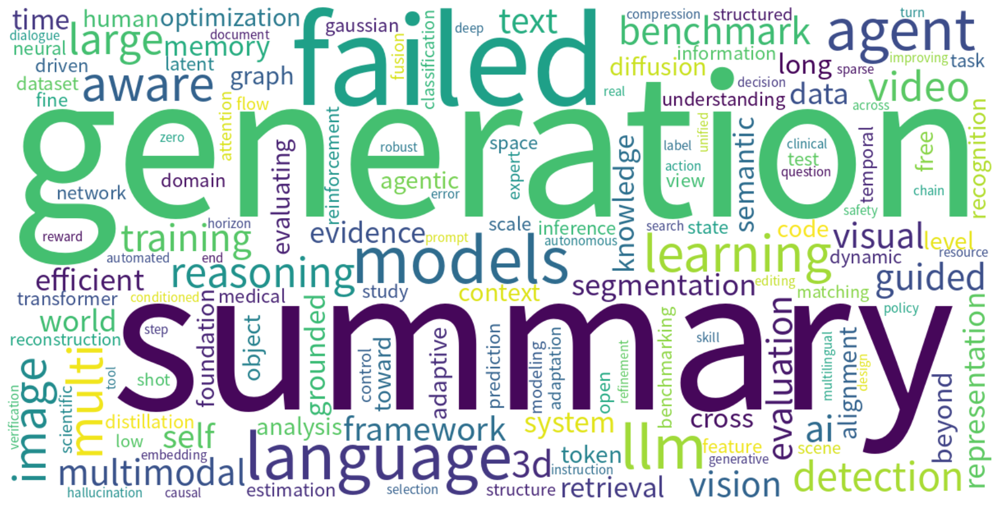

# Monthly arXiv Review — September 2026

**Period:** 2026-09-01 to 2026-09-30  
**Total papers:** 6159  
**Active weeks:** 5  

---

## 📈 Paper Volume Ranking by Category

| Rank | Category | Papers | Share |
| ---: | -------- | -----: | ----: |
| 1 | cs.CV | 2196 | 35.7% |
| 2 | cs.AI | 1769 | 28.7% |
| 3 | cs.CL | 1694 | 27.5% |
| 4 | cs.IT | 260 | 4.2% |
| 5 | cs.GT | 139 | 2.3% |
| 6 | cs.CE | 101 | 1.6% |

---

## ☁️ Research Hotspot Word Cloud

*The word cloud above visualizes the most frequently appearing research topics and concepts across all papers this month.*

---

## 📅 Weekly Hotspot Evolution

| Week | Papers | Top Research Topics |
| ---- | -----: | ------------------- |
| 2026-W36 | 1635 | — |
| 2026-W37 | 1406 | — |
| 2026-W38 | 1036 | — |
| 2026-W39 | 1389 | — |
| 2026-W40 | 693 | — |

---

## 🤖 AI-Generated Monthly Trend Analysis

Trend analysis generation failed.

---

*Generated automatically on 2026-10-01 11:27 UTC*