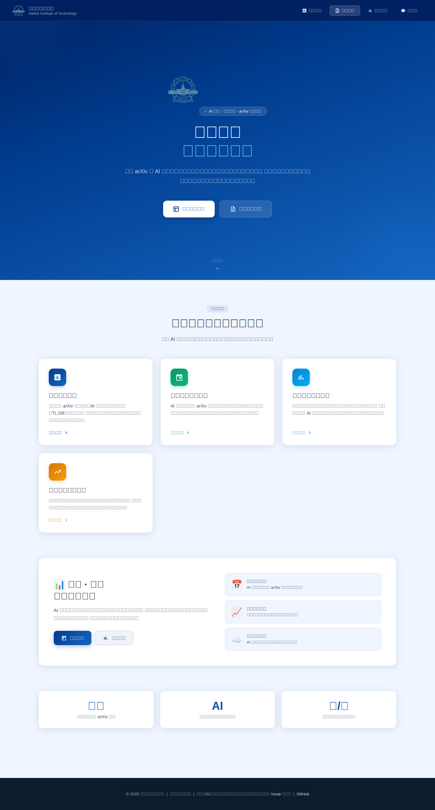
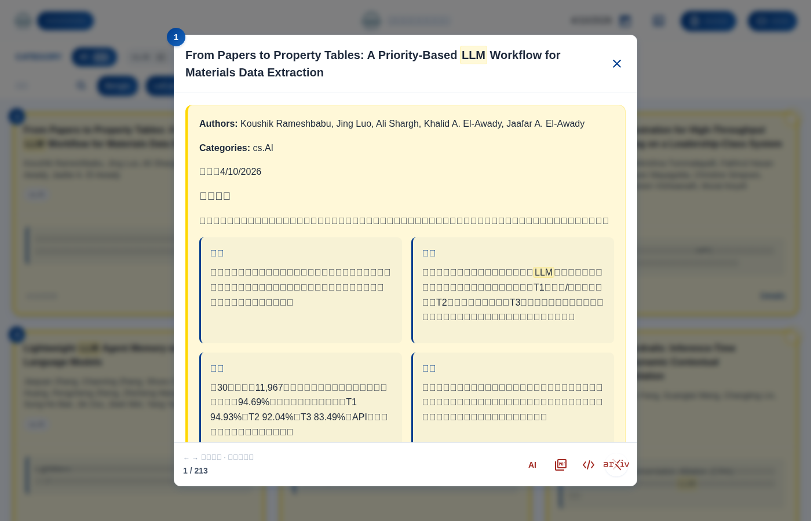
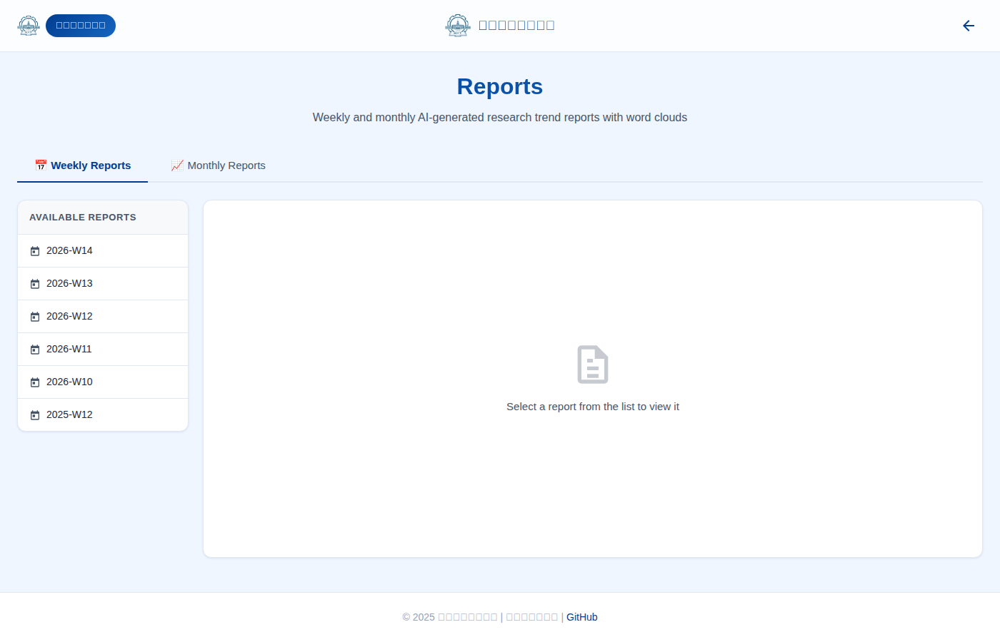
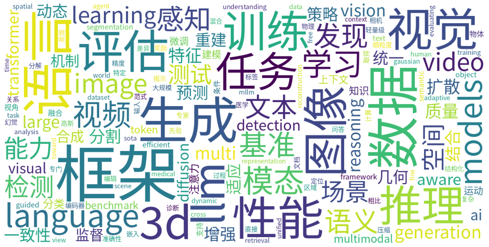

# 学术论文跟踪助手（中期答辩材料）

> 项目：daily-arXiv-ai-enhanced  
> 团队：哈尔滨工业大学大一年度项目组

---

## 1. 我们目前做了什么（中期完成情况）

### 1.1 已完成功能

- **每日自动追踪**：按 arXiv 分类抓取最新论文
- **自动去重**：对比近 7 天历史，过滤重复论文
- **AI 结构化增强**：自动生成 TL;DR / Motivation / Method / Result / Conclusion
- **自动日报生成**：将增强后的数据转为 Markdown 日报
- **周报生成（Map-Reduce）**：提取热点主题并输出周总结
- **月报生成（趋势分析）**：统计分类趋势并生成词云
- **纯静态网页展示**：支持论文看板、统计页、报告页、设置页
- **GitHub Actions 全自动调度**：日更/周更/月更全流程自动运行

### 1.2 阶段性成果（截至当前仓库）

- 日原始数据文件：**299** 份
- AI 增强数据文件：**296** 份
- 日报文件：**298** 份
- 周报：**8** 份
- 月报：**2** 份
- 月度词云图：**2** 张

---

## 2. 系统运作机理（老师最关注）

## 2.1 端到端主流程

```text
arXiv分类页
  -> Scrapy抓取论文ID
  -> data/YYYY-MM-DD.jsonl
  -> 近7天去重
  -> LLM结构化增强
  -> data/YYYY-MM-DD_AI_enhanced_*.jsonl
  -> 转换为Markdown日报
  -> 更新索引文件
  -> GitHub Pages静态展示
```

## 2.2 关键模块说明

- **抓取层**：`daily_arxiv/daily_arxiv/spiders/arxiv.py`
- **去重层**：`daily_arxiv/daily_arxiv/check_stats.py`
- **AI 增强层**：`ai/enhance.py`
- **日报渲染层**：`to_md/convert.py`
- **周报层**：`ai/weekly_summary.py`
- **月报层**：`ai/monthly_summary.py`
- **自动化调度**：`.github/workflows/run.yml` / `weekly.yml` / `monthly.yml`
- **前端展示**：`js/app.js` / `js/statistic.js` / `js/reports.js`

## 2.3 周报与月报机制

- **周报**：先按论文提取主题词（Map），再统计聚合热点（Reduce），最后由 LLM 生成周趋势总结
- **月报**：汇总全月论文，统计分类变化，生成词云，并输出月度趋势综述

---

## 3. 图文展示（答辩可直接投屏）

### 首页


### 论文详情（含结构化 AI 摘要）


### 周报/月报页面


### 月度词云示例


---

## 4. 三位评审子Agent质询与参考回答（可作 Q&A 备稿）

## 4.1 评审A（架构方向）

1. **问：为什么依赖 GitHub Actions，不担心单点故障吗？**  
   **答：**当前采用“静态发布 + 增量更新”，即使某日失败也不影响历史内容可访问；后续会补告警与重试增强。

2. **问：去重为什么设 7 天？会不会漏掉更早重复？**  
   **答：**中期先平衡效率与效果，7 天覆盖高频重复场景；后续会扩展长期 ID 索引。

3. **问：多处 workflow 有重复逻辑，可维护性如何？**  
   **答：**已识别为技术债，后续计划抽成统一脚本，减少重复配置。

## 4.2 评审B（算法方向）

1. **问：如何证明摘要质量，不只是“能生成”？**  
   **答：**后续建立人工标注集，评估事实一致性、可读性、关键信息覆盖率。

2. **问：周报主题抽取会不会被同义词干扰？**  
   **答：**会，后续会做术语归一化（同义词映射/聚类）提升热点稳定性。

3. **问：月报词云如何避免“无意义高频词”？**  
   **答：**已做停用词过滤与 LLM 二次过滤，后续加入人工抽检指标。

## 4.3 评审C（工程与安全方向）

1. **问：Secrets 与接口调用安全如何保证？**  
   **答：**密钥存放在 GitHub Secrets，不写入仓库；后续补更细粒度安全审计与依赖固定版本。

2. **问：前端密码保护是否等于强鉴权？**  
   **答：**不是，当前是轻量访问门槛；若需强鉴权将切换服务端认证方案。

3. **问：出现外部 API 波动时怎么办？**  
   **答：**当前有兜底与跳过策略，后续补降级策略与告警机制。

---

## 5. 三个团队子Agent给出的答辩重点

## 5.1 Agent A（成果表达）

- 按“功能闭环”讲：抓取 → 去重 → AI增强 → 报告 → 展示
- 强调“已持续产出”而非单次 Demo
- 演示时优先展示详情页 AI 结构化摘要与周/月报

## 5.2 Agent B（机制表达）

- 推荐三张图：**架构图、时序图、数据流图**
- 讲清楚每个输出文件如何被下一步消费
- 讲清楚“为什么纯静态也能完成完整产品链路”

## 5.3 Agent C（答辩策略）

- 老师高频关注：价值、质量、稳定性、安全边界、可扩展性
- 每个问题先给结论，再给证据（代码文件/产出数量）
- 5–8 分钟建议顺序：背景 → 架构 → 成果 → 演示 → 风险与计划

---

## 6. 老师可能追问的问题（扩展版）

1. 为什么选 arXiv 作为入口？
2. 为什么是“日报+周报+月报”三层结构？
3. 如果模型输出错误，怎么降低影响？
4. 如何控制 API 成本？
5. 系统是否支持多学科扩展？
6. 如何评估周报/月报“有用性”？
7. 你们和现有文献工具相比核心优势是什么？
8. 当前最薄弱环节是什么，准备怎么补？

---

## 7. 中期后计划（简版）

- 建立摘要质量评测基线（人工+自动指标）
- 优化主题聚类与趋势分析稳定性
- 提升工程质量（告警、测试、脚本去重）
- 强化安全与访问控制边界说明

---

## 8. 一句话总结

我们已经把“论文追踪—理解—汇报—展示”做成可持续自动运行的工程系统；中期后重点从“能跑”升级到“更准、更稳、更可评估”。
